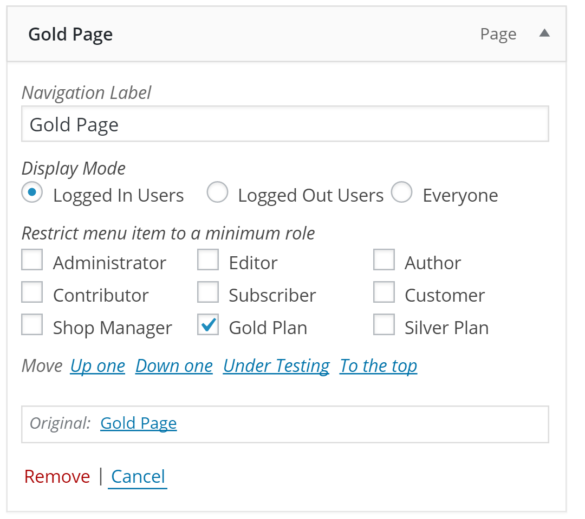

# Nav Menu Roles + YITH WooCommerce Memberships  

A bridge plugin that adds YITH WooCommerce Membership Plans to Nav Menu Roles menu options. 
It is adapted from helgatheviking plugin, working only for Woo Commerce Membership plugin.

## Requirements
1. [Nav Menu Roles](https://wordpress.org/plugins/nav-menu-roles/)
2. [WooCommerce Memberships](https://yithemes.com/themes/plugins/yith-woocommerce-membership/)
3. Nav Menu Roles + YITH WooCommerce Membership

All three plugins must be installed, and activated in order to get the desired result. 

## Usage

1. Go to Appearance > Menus
1. Set the "Display Mode" to "Logged In Users"
1. Under "Restrict menu item to a minimum role" you will now see all your WooCommerce Memberships
1. Check the boxes next to the desired memberships

## Credtis & Donate 

Absolutly don't care about rewards. 
Please donate to the initial idea from : [helgatheviking-Woocommerce-membership](https://github.com/helgatheviking/nav-menu-roles-woocommerce-memberships) , first implemented for Woo Commerce Membership plugin.

